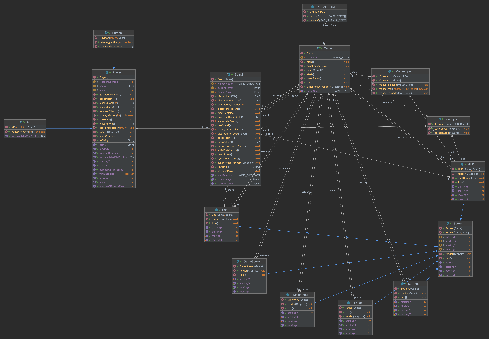

# MahjongJava
Building Mahjong in Java using Swing, Thumbnailator and Name Machine.

Credits for the Mahjong tile faces goes to [Wikipedia](https://en.wikipedia.org/wiki/Mahjong_tiles)

## Structure of the Game

## Installation

## Usage

